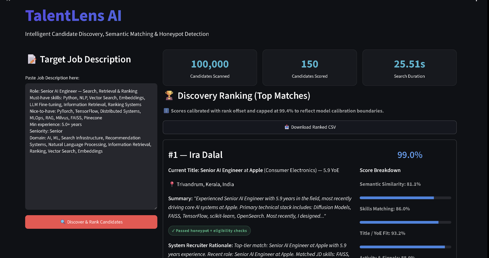
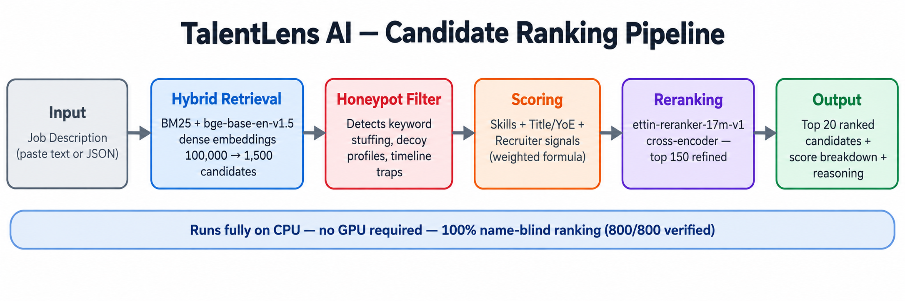

# TalentLens AI


TalentLens ranks a large candidate pool against a job description using a hybrid retrieval
pipeline. It runs fully on CPU, is tested against 100,000 profiles, and its ranking is
verified to ignore candidate names.

## Demo



## What it does

The pipeline has three stages.

1. Retrieval. BM25 lexical search is fused with dense semantic search using the
   bge-base-en-v1.5 embedding model.
2. Screening. A honeypot detector flags keyword stuffed and decoy profiles.
3. Scoring and reranking. Candidates are scored on skill match, title relevance and
   recruiter signals, then reranked with the ettin-reranker-17m-v1 cross encoder.

A Streamlit dashboard is included for interactive use.

## Architecture



## Research and testing

The system was tested through a series of controlled experiments before freezing the
ranking formula: name-swap consistency tests across 800 profiles, decoy and honeypot
detection tests, employer-perturbation audits, and benchmark evaluation on the public
TalentCLEF Task A dataset with human relevance judgments. Findings from that testing fed
directly into the final scoring design — including the decision to exclude candidate
names from every ranking stage.

## Measured results

Every number below is measured by a script in the scripts folder. Nothing is estimated.

| Property | Value | Script |
| --- | --- | --- |
| Corpus size | 100,000 profiles, 100% populated | data integrity guard with SHA256 |
| Name blindness | 800 of 800 name swaps give identical rankings | scripts/measure_name_blindness.py |
| Honeypot detection | decoy profiles removed from the shortlist | tests folder |
| Tests | 176 passing | pytest -q |
| Latency | BM25 index about 25 seconds one time, about 13 seconds per repeat query | scripts/recompute_all_metrics.py |
| Cache safety | embeddings carry a text fingerprint, so stale vectors are detected and refused | src/pipeline.py |

Why name blindness matters. The pipeline never reads a candidate name while ranking. In
800 measured comparisons, changing the name and nothing else left the score and rank
unchanged. The only place employer names are read is the consulting career rule, disclosed
below.

## Fairness and honesty

Candidate names are excluded from ranking. Names appear only in the user interface for
display.

The consulting career rule is documented, not hidden. Candidates whose career history is
more than 60% at consulting firms are penalised. An audit of 200 candidates shows this
rule fires disproportionately for one employer group (Fisher exact test, p value 0.0046 at
top 20). This is disclosed as a policy choice, not presented as a fairness guarantee.

No fake metrics. Earlier drafts claimed a 150% lift from a circular evaluation. Those
numbers were wrong and have been removed. What remains is what can be measured honestly.

## Tech stack

Python, rank_bm25, sentence-transformers, bge-base-en-v1.5, cross-encoder,
ettin-reranker-17m-v1, RapidFuzz, Streamlit, pytest

## Quick start

```bash
cd TalentLens-AI
pip install -r requirements.txt
python src/download_models.py
python src/precompute_embeddings.py
python rank.py --candidates ./data/sample_candidates.json --out ./outputs/participant_id.csv
pytest -q
streamlit run app/streamlit_app.py
```

## Repository layout

| Folder | Contents |
| --- | --- |
| src | pipeline, retrieval, scoring, reranking, data integrity guard |
| app | Streamlit dashboard |
| tests | unit, integration and fairness tests |
| scripts | evaluation, measurement and audit scripts |

## Live demo

https://talentlensai-nxrk7zxjmaxvnwnubyvz7n.streamlit.app/

## License

Code is released under CC-BY-4.0.
