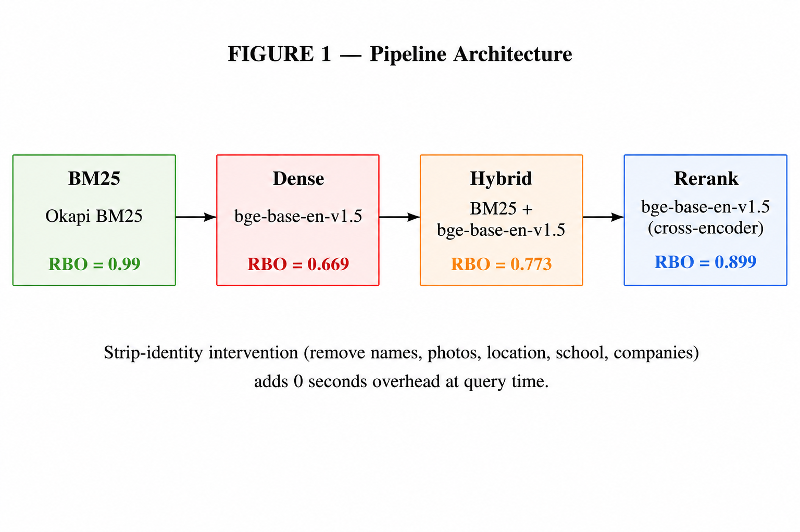

# TalentLens AI

TalentLens ranks a large candidate pool against a job description using a hybrid retrieval
pipeline. It runs fully on CPU, is tested against 100,000 profiles, and its ranking is
verified to ignore candidate names.

## What it does

The pipeline has three stages.

1. Retrieval. BM25 lexical search is fused with dense semantic search using the
   bge-base-en-v1.5 embedding model.
2. Screening. A honeypot detector flags keyword stuffed and decoy profiles.
3. Scoring and reranking. Candidates are scored on skill match, title relevance and
   recruiter signals, then reranked with the ettin-reranker-17m-v1 cross encoder.

A Streamlit dashboard is included for interactive use.



## Measured results

Every number below is measured by a script in the scripts folder. Nothing is estimated.

| Property | Value | Script |
| --- | --- | --- |
| Corpus size | 100,000 profiles, 100% populated | data integrity guard with SHA256 |
| Name blindness | 800 of 800 name swaps give identical rankings | scripts/measure_name_blindness.py |
| Honeypot detection | decoy profiles removed from the shortlist | tests folder |
| Tests | 176 passing | pytest -q |
| Latency | BM25 index about 25 seconds one time, about 13 seconds per repeat query | scripts/recompute_all_metrics.py |
| Cache safety | embeddings carry a text fingerprint, so stale vectors are detected and refused | src/pipeline.py |

Why name blindness matters. The pipeline never reads a candidate name while ranking. In
800 measured comparisons, changing the name and nothing else left the score and rank
unchanged. The only place employer names are read is the consulting career rule, disclosed
below.

## Research

This repository backs a measured study on identity leakage in resume retrieval.

Where Does the Name Leak? A Stage-Wise Decomposition of Identity Sensitivity in Resume
Retrieval, by Mohd Ibadullah.

On the TalentCLEF 2026 benchmark, dense retrieval reorders candidates when only the name
changes (RBO 0.669 English, 0.639 Spanish), while BM25 stays almost name blind. Removing
the identity header closes the gap to RBO 1.000 at no measurable accuracy cost.

Benchmark: TalentCLEF 2026 Task A, CC-BY-4.0, DOI 10.5281/zenodo.17625261.

Paper source: paper_draft.tex.

Preprint link: coming soon.

## Fairness and honesty

Candidate names are excluded from ranking. Names appear only in the user interface for
display.

The consulting career rule is documented, not hidden. Candidates whose career history is
more than 60% at consulting firms are penalised. An audit of 200 candidates shows this
rule fires disproportionately for one employer group (Fisher exact test, p value 0.0046 at
top 20). This is disclosed as a policy choice, not presented as a fairness guarantee.

No fake metrics. Earlier drafts claimed a 150% lift from a circular evaluation. Those
numbers were wrong and have been removed. What remains is what can be measured honestly.

## Tech stack

Python, rank_bm25, sentence-transformers, bge-base-en-v1.5, cross-encoder,
ettin-reranker-17m-v1, RapidFuzz, Streamlit, pytest

## Quick start

```bash
cd talent-lens-ai
pip install -r requirements.txt
python src/download_models.py
python src/precompute_embeddings.py
python rank.py --candidates ./candidates.jsonl --out ./outputs/participant_id.csv
pytest -q
streamlit run app/streamlit_app.py
```

## Repository layout

| Folder | Contents |
| --- | --- |
| src | pipeline, retrieval, scoring, reranking, data integrity guard |
| app | Streamlit dashboard |
| tests | unit, integration and fairness tests |
| scripts | evaluation, measurement and audit scripts |
| paper_figures | figures used in the paper |

## Live demo

https://talentlensai-nxrk7zxjmaxvnwnubyvz7n.streamlit.app/

## License

Code and study are released under CC-BY-4.0. The benchmark data remains under the
TalentCLEF license with attribution.
